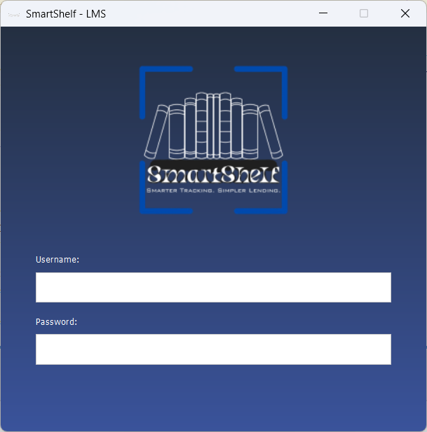
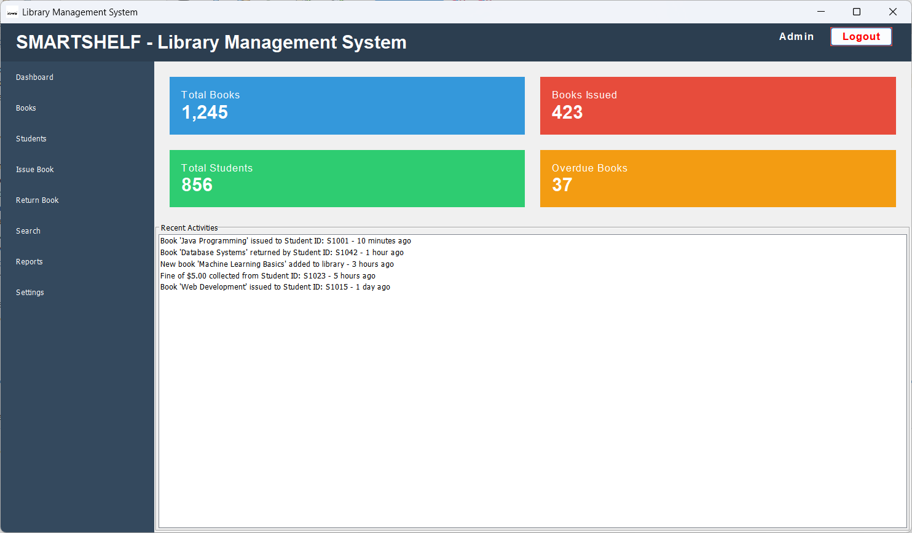
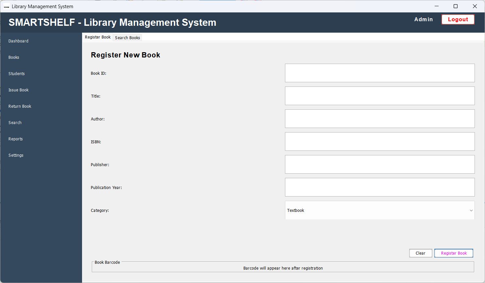
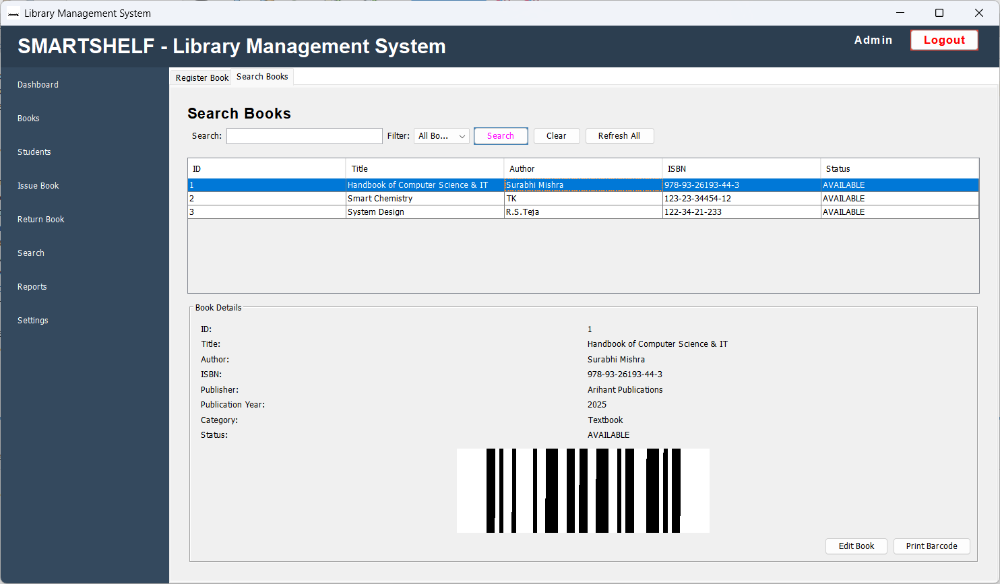
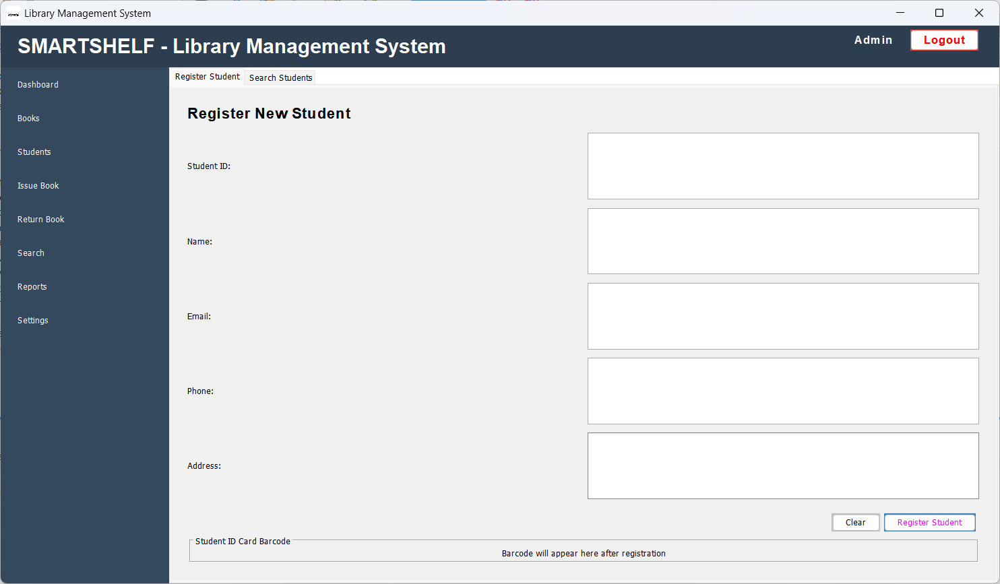
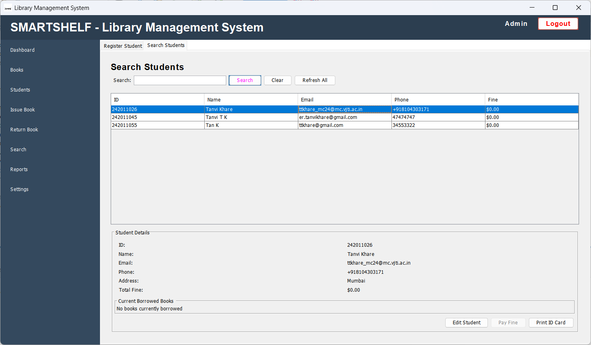
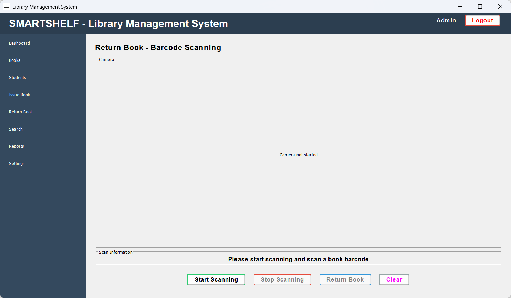
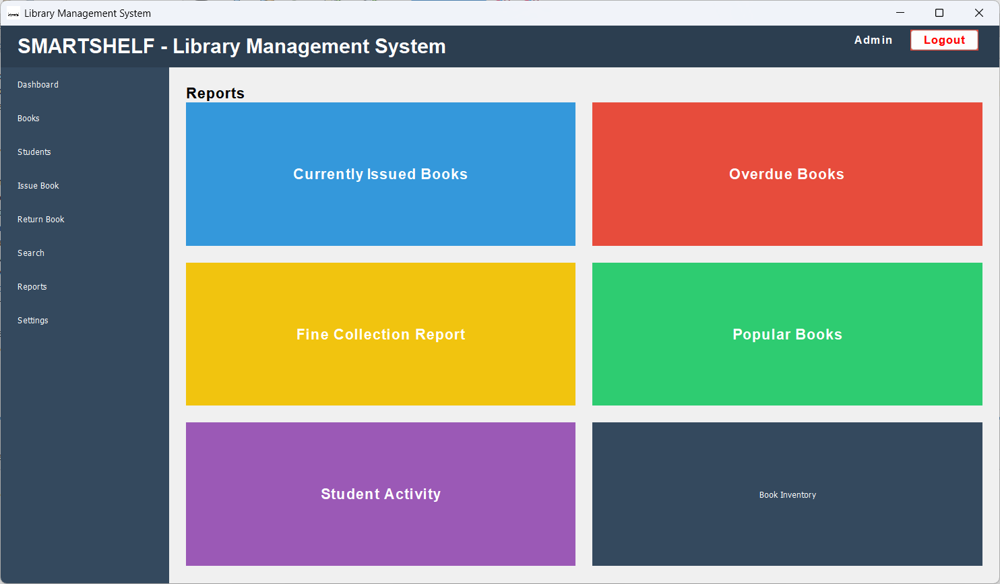
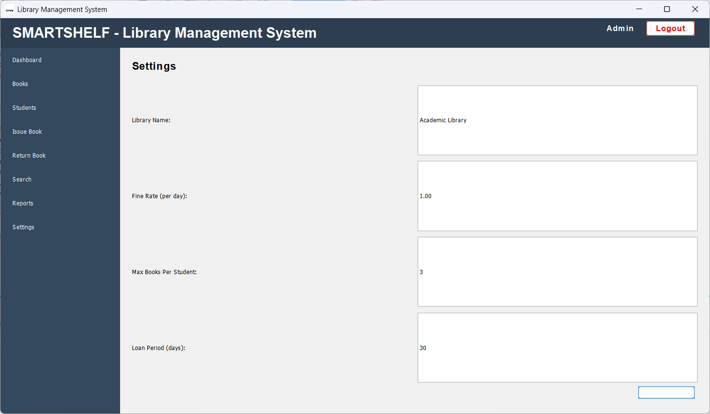

# 📚 SmartShelf — Library Management System with Barcode Integration

SmartShelf is a Java-based Library Management System built using Swing in NetBeans. It simplifies the process of issuing and returning books using barcode scanning for both books and students. Designed for school or university libraries, it maintains accurate records of borrow/return transactions and automatically calculates due dates and penalties.

---

## 🚀 Key Features

### 🧾 Book Issue & Return
- Scan **book barcode** and **student ID barcode**
- Automatic due date assignment (default: 1 month)
- Prevents issuing already issued books
- Allows returning books via scanning only the book

### 📖 Records Management
- View history of books issued to a student
- View history of students who borrowed a book
- Track issued and available books in real-time

### ⏰ Due Date & Penalties
- One-month default due date
- Automatically calculates penalties for overdue books

### 🧑‍💼 Admin Access
- Secure admin login
- Add/edit books and student records
- Monitor all library activities through a clean interface

---

## 🧪 Tech Stack

- **Java Swing** – Desktop application UI
- **NetBeans IDE** – Development platform
- **MySQL** – Database for storing student, book, and transaction records
- **ZXing** – For barcode scanning using camera
- **FlatLaf** – Modern dark/light theme for better UX

---

## 📁 Project Modules

| File/Class              | Purpose                                     |
|-------------------------|---------------------------------------------|
| `LoginForm.java`        | Admin login screen                          |
| `IssueBook.java`        | Scans book and student barcodes to issue    |
| `ReturnBook.java`       | Handles book return via barcode             |
| `StudentHistory.java`   | Displays book issue history of a student    |
| `BookHistory.java`      | Displays borrowing history of a book        |
| `PenaltyCalculator.java`| Calculates late return penalties            |

---

## 📸 Screenshots

### 🔐 Login Page  

### 🛠️ Admin Dashboard  

### 📚 Book Registration  

### 👩‍🏫 Book Details  

### 👧🏻 Student Registration  

### 🧑‍🎓 Student Details  

### 🫴 Issue Book Panel  

### 🔎 Return Book Panel  

### 📝 Reports  

### ⚙️ Settings  

---

## 🛠️ How It Works

1. **Admin logs in** to the system.
2. On book issue:
   - Scan the **book barcode** (fetches book details).
   - Then scan the **student ID** (fetches student details).
   - If the book is available, it gets issued with a due date.
3. On return:
   - Scan only the **book barcode**.
   - The system checks if it was issued and calculates any penalty.
4. All records are stored and retrievable through search and view options.

---

## 💡 Future Enhancements

- Email/SMS notifications for due dates
- Face ID for student verification
- Generate monthly reports for library statistics
- Integrate with RFID instead of barcode

---

## 👩‍💻 Author

**Tanvi Khare**  

---

## 📄 License

This project is licensed under the MIT License. See the `LICENSE` file for more details.
